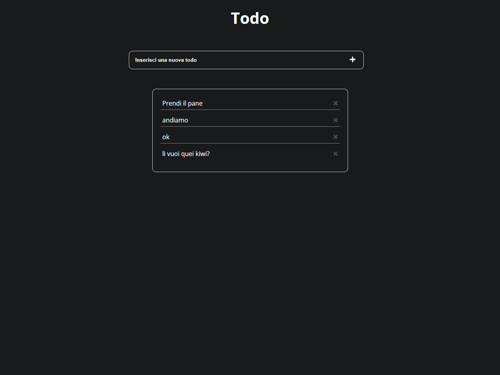

# rest-todoolean **:open_file_folder:**

:man_student:--Task:

- Creazione di una todo list con le seguenti funzionalità, attraverso l’uso delle API, AJAX, jQuery e Handlebars
- Lettura di tutti i todo
- Creazione nuovo todo
- Cancellazione todo

 ​ ​ :desktop_computer: Project Preview:

 ​ ​ ​ ​ ​ ​ ​ ​ ​ ​ ​ ​ ​ ​ ​ ​ ​ ​ ​ ​ ​ ​ ​ ​ 

#

 ​ ​ ​ ​ ​ ​ ​ ​ ​ ​ ​ ​ ​ ​ ​ ​ ​ ​ ​ ​ ​ ​ ​ ​ ​ ​ ​ ​ ​ ​ ​ ​ ​ ​ ​ ​ ​ ​ ​ ​ ​ ​ ​ ​ ​ ​ ​ ​ ​ ​ ​ ​ ​ ​ ​ ​ ​ ​ ​ ​ ​ :eyes: Visit My Github Profile to see other [__Project__](https://github.com/Vincenzo-Laveneziana?tab=repositories):man_technologist: 
#

